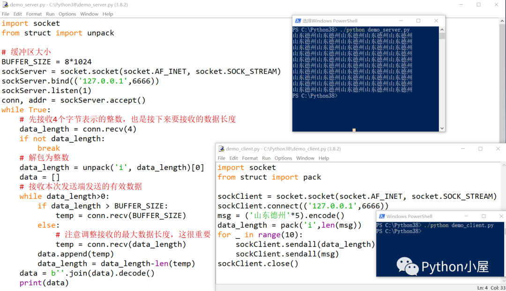

# socket接口封装

> 可用参考文献：[python cookbook](https://python3-cookbook.readthedocs.io/zh-cn/latest/chapters/p11_network_and_web_program.html)

## 要实现的功能

- 广播服务器：接受多个输入，发送多个输出=接受多个客户端的查询和修改请求，发送最新的链结果
- 挖矿服务器：发送单个输出，接受单个输入=每隔一段时间发送一个查询请求，更新链结果；挖出来块后发送修改请求，请求更新链结果
- 钱包服务器：发送单个输出，接受单个输入=发送查询请求，进行余额查询

> socketLab文件夹中存放部分测试代码

## 功能抽象

- 广播服务器：监听功能（检查连接的建立和断开）；接收功能（接收客户端的查询和修改请求）；发送功能（发送最新的链结果）
- 挖矿服务器：接收功能（接收查询请求，更新链结果）；发送功能（挖出来块后发送修改请求，请求更新链结果）
- 钱包服务器：接收功能（接收查询请求，进行余额查询）；发送功能（发送查询请求，进行余额查询）

因此要在较顶层的类中实现接受和发送功能

监听功能最好也在顶层类中实现

类的定义上，Log类应该作为基类，协议类Protocol继承Log类，网络接口类WebConnection也继承Log类，其他的具体类应该继承WebConnection和Protocol类

## 功能拆分

```text
- sockets
|-- LogModule.py
|   |-- Log: Log类，用于记录日志
|-- Protocol.py
|   |-- GCBPProtocol: GCBPProtocol类，用于定义GCB协议和服务器客户端基本操作
|       |-- GCBmsg: 生成符合GCB协议格式的消息
|       |-- check_format: 检查输入值GCBmsg是否符合GCB格式
|-- WebConnection.py
|   |-- webConnection: webConnection类，用于定义网络接口
|       |-- send: 
|       |-- load: 
|-- Client.py
|   |-- client: 测试用客户端类，继承GCBPProtocol和WebConnection类，用于连接服务器，并提出查询或者修改请求
|       |-- request: 发送请求给服务器，使用继承的send和load方法
|-- Server.py
|   |-- server: 测试用服务器类，继承GCBPProtocol和WebConnection类，用于接收客户端请求，并且发送相应回复
|       |-- handle: 处理特定客户端连接，使用继承的send和load方法
|       |-- start: 启动服务器，开始接受信息
```

## 关于TCP传输时粘包等问题

> 参考：[TCP粘包](https://cloud.tencent.com/developer/article/1614471)

现采用文章中这种写法：

